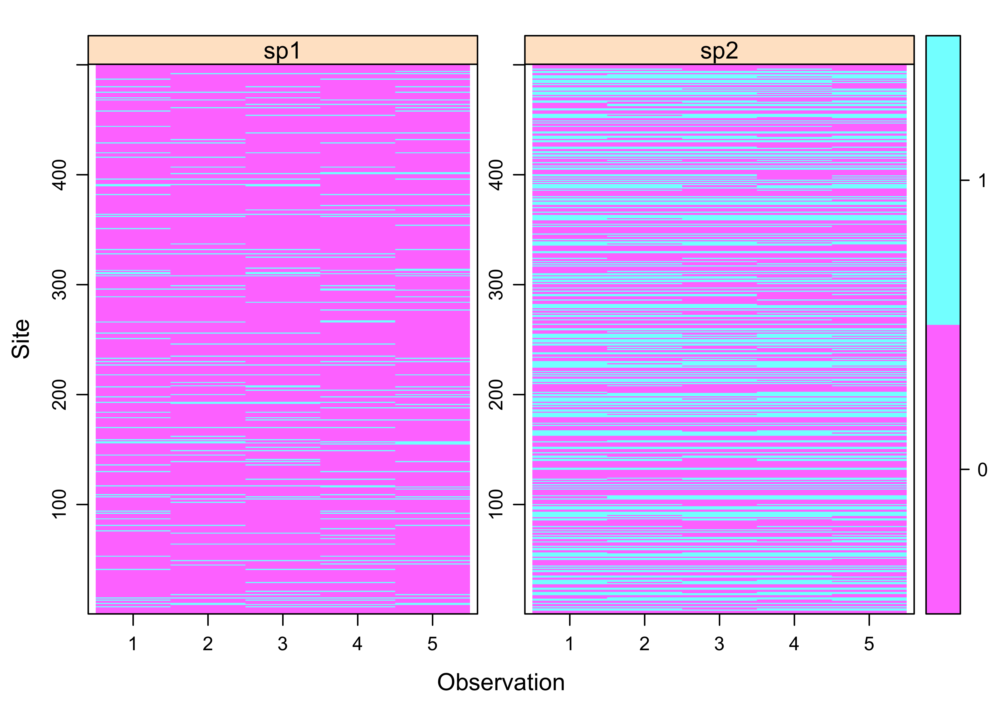

# Simulate data and fit 2-species occupancy model à la Rota et al. (2016) w/ the R package unmarked

We consider a two-species static occupancy model à la [Rota et al. (2016)](https://besjournals.onlinelibrary.wiley.com/doi/full/10.1111/2041-210X.12587). We simulate data from this model, and fit the model to these data using `Unmarked`. With the [Rmd file](https://github.com/oliviergimenez/2speciesoccupancy/blob/master/simul_rota.Rmd), you can run the code in RStudio and reproduce the results. 

## Setting the scene


Ignoring the site index, we use the following notation for the occupancy probabilities:


*  is the prob. that species 1 and species 2 are both present;  
*  is the prob. that species 1 is present and species 2 is absent;
*  is the prob. that species 1 is absent and species 2 is present;
*  is the prob. that species 1 and species 2 are both absent,
with avec 

The marginal probabilities of occupancy are:

* %20%3D%20%5CPr(%5Ctext%7Bspecies%201%20is%20present%7D)%20%3D%20%5Cpsi_%7B10%7D%20%2B%20%5Cpsi_%7B11%7D%24)
* %20%3D%20%5CPr(%5Ctext%7Bspecies%202%20is%20present%7D)%20%3D%20%5Cpsi_%7B01%7D%20%2B%20%5Cpsi_%7B11%7D%24)
* %20%3D%20%5CPr(%5Ctext%7Bspecies%201%20is%20absent%7D)%20%3D%20%5Cpsi_%7B01%7D%20%2B%20%5Cpsi_%7B00%7D%24)
* %20%3D%20%5CPr(%5Ctext%7Bspecies%202%20is%20absent%7D)%20%3D%20%5Cpsi_%7B10%7D%20%2B%20%5Cpsi_%7B00%7D%24)

And the conditional probabilities given that %20%3D%20%5CPr(%5Ctext%7BA%20and%20B%7D)%2F%5CPr(%5Ctext%7BB%7D)%24):

* %20%3D%20%5Cpsi_%7B10%7D%20%2F%20(%5Cpsi_%7B10%7D%20%2B%20%5Cpsi_%7B00%7D)%20%3D%20%5CPr(%5Ctext%7Bspecies%201%20is%20present%20given%20species%202%20is%20absent%7D)%3B%24)
* %20%3D%20%5Cpsi_%7B11%7D%20%2F%20(%5Cpsi_%7B11%7D%20%2B%20%5Cpsi_%7B01%7D)%20%3D%20%5CPr(%5Ctext%7Bspecies%201%20is%20present%20given%20species%202%20is%20present%7D)%3B%24)
* %20%3D%20%5Cpsi_%7B01%7D%20%2F%20(%5Cpsi_%7B01%7D%20%2B%20%5Cpsi_%7B00%7D)%20%3D%20%5CPr(%5Ctext%7Bspecies%202%20is%20present%20given%20species%201%20is%20absent%7D)%3B%24)
* %20%3D%20%5Cpsi_%7B11%7D%20%2F%20(%5Cpsi_%7B11%7D%20%2B%20%5Cpsi_%7B10%7D)%20%3D%20%5CPr(%5Ctext%7Bspecies%202%20is%20present%20given%20species%201%20is%20present%7D).%24)

## Data simulation

We will use the package `mipfb` to simulate occupancy state as a multivariate Bernoulli random variable; more about the multivariate Bernoulli can be found in [Dai et al. (2013)](https://arxiv.org/pdf/1206.1874.pdf):

```r
library(mipfp)
```

For reproducibility, we set the seed:

```r
set.seed(2020) 
```

Choose the number of species, the number of sites, and the number of visits: 

```r
S <- 2 # nb species 
N <- 500 # nb sites
J <- 5 # nb visits
```

Let's consider a scenario in which species 2 avoids species 1 while species 1 does not care about species 2 and its presence or absence. To specify this scenario, we will work out the conditional probabilities with, for example:

* %20%3D%200.6%24), species 2 is present with high probability whenever species 1 is absent
* %20%3D%200.1%24), species 2 avoids species 1 when it is present
* %20%3D%20%5CPr(z_1%20%3D%201%20%7C%20z_2%20%3D%201)%20%3D%200.4%24), species 1 does not care about presence/absence of species 2

Now we need to go back to the occupancy probabilities. Let , ,  so that , then we have a system of 3 equations with 3 unknowns:

%20%5CLeftrightarrow%20x%20%2B%200.6y%20%2B%200.6z%20%3D%200.6%24)

%20%5CLeftrightarrow%20-0.1y%20%2B%200.9z%20%3D%200%24)

%20%5CLeftrightarrow%200.4x%20%2B%20y%20%2B%200.4z%20%3D%200.4%24)

which can be solved with the [Mathematica online solver](https://www.wolframalpha.com/input/?i=solve%7Bx%2B0.6y%2B0.6z%3D%3D0.6%2C-0.1y%2B0.9z%3D%3D0%2C0.4x%2By%2B0.4z%3D%3D0.4%7D): 

```r
psi01 <- 81/175
psi10 <- 36/175
psi11 <- 4/175
psi00 <- 1 - (psi01 + psi10 + psi11) # 54/175
```

In `R`, we could use
```
a <- matrix(c(1,0.6,0.6,0,-0.1,0.9,0.4,1,0.4),ncol=3,byrow=T)
b <- matrix(c(0.6,0,0.4),ncol=1)
solve(a,b)
```

```
## 0.46285714
## 0.20571429
## 0.02285714
```

We then obtain the marginal occupancy probabilities:

```r
psiS1 <- psi10 + psi11
psiS2 <- psi01 + psi11
```

Now we're ready to simulate data from a multivariate Bernoulli (check out `?RMultBinary` and `?ObtainMultBinaryDist`).

First, we calculate the odds ratios:

```r
or <- matrix(c(1, (psiS1*(1-psiS2))/(psiS2*(1-psiS1)), 
               (psiS2*(1-psiS1))/(psiS1*(1-psiS2)), 1), nrow = 2, ncol = 2, byrow = TRUE)
rownames(or) <- colnames(or) <- c("sp1", "sp2")
```

Then the marginal probabilities:

```r
marg.probs <- c(psiS1, psiS2)
```

And we estimate the joint probability:

```r
p.joint <- ObtainMultBinaryDist(odds = or, marg.probs = marg.probs)
```

At last, we generate $N$ random samples from a bivariate Bernoulli (2 species) with relevant parameters

```r
z <- RMultBinary(n = N, mult.bin.dist = p.joint)$binary.sequences 
```

Now we add on top the observation. First, we fix the detection probability for each species:

```r
ps <- c(0.5,0.9)
```

Then we generate the detection and non-detections for each species, which we store in a list: 

```r
y <- list()
for (i in 1:S){
  y[[i]] <- matrix(NA,N,J)
  for (j in 1:N){
    for (k in 1:J){
      y[[i]][j,k] <- rbinom(1,1,z[j,i]*ps[i])
    }
  }
}
names(y) <- c('sp1','sp2')
```

## Model fitting

Now let us fit a 2-species static occupancy model to the data we have simulated. We need to load the package `unmarked`:

```r
library(unmarked)
```

We format the data as required:

```r
data <- unmarkedFrameOccuMulti(y=y)
```

Let's have a look to the data:

```r
summary(data)
```

```
## unmarkedFrame Object
## 
## 500 sites
## 2 species: sp1 sp2 
## Maximum number of observations per site: 5 
## Mean number of observations per site:
## sp1: 5  sp2: 5  
## Sites with at least one detection:
## sp1: 113  sp2: 238  
## Tabulation of y observations:
## sp1:
##    0    1 
## 2210  290 
## sp2:
##    0    1 
## 1425 1075
```

And in particular the detections and non-detections:

```r
plot(data)
```

<!-- -->

Now we specify the effects we would like to consider on the occupancy and detection probabilities. The thing is that the function `occuMulti` doesn't work directly on the occupancy probabilities but on the so-called natural parameters (in that specific order): 

* $f_1 = \log(\psi_{10}/\psi_{00})$;
* $f_2 = \log(\psi_{01}/\psi_{00})$;
* $f_{12} = \log(\psi_{00}\psi_{11} / \psi_{10}\psi_{01})$, 

that is:

* $\psi_{11} = \exp(f_1+f_2+f_{12})/\mbox{den}$;
* $\psi_{10} = \exp(f_1)/\mbox{den}$;
* $\psi_{01} = \exp(f_2)/\mbox{den}$,
where $\mbox{den} = 1+\exp(f_1)+\exp(f_2)+\exp(f_1+f_2+f_{12})$:

```r
occFormulas <- c('~1','~1','~1') 
```

To specify the effects on detection, there is no difficulty:

```r
detFormulas <- c('~1','~1')
```

We fit a model with constant natural parameters and constant detection probabilities

```r
fit <- occuMulti(detFormulas,occFormulas,data)
```

Display the result:

```r
fit
```

```
## 
## Call:
## occuMulti(detformulas = detFormulas, stateformulas = occFormulas, 
##     data = data)
## 
## Occupancy:
##                       Estimate    SE      z  P(>|z|)
## [sp1] (Intercept)      -0.8862 0.139 -6.355 2.09e-10
## [sp2] (Intercept)       0.0636 0.103  0.619 5.36e-01
## [sp1:sp2] (Intercept)  -0.7042 0.225 -3.136 1.71e-03
## 
## Detection:
##                   Estimate     SE      z   P(>|z|)
## [sp1] (Intercept)  -0.0132 0.0906 -0.146  8.84e-01
## [sp2] (Intercept)   2.2351 0.0981 22.777 7.72e-115
## 
## AIC: 2758.236
```

Get the natural parameter and detection estimates:

```r
mle <- fit@opt$par
names(mle) <- c('f1','f2','f12','lp1','lp2')
```

Get the occupancy estimates:

```r
den <- 1 + exp(mle['f1'])+exp(mle['f2'])+exp(mle['f1']+mle['f2']+mle['f12'])
psi11hat <- exp(mle['f1']+mle['f2']+mle['f12'])/den
psi10hat <- exp(mle['f1'])/den
psi01hat <- exp(mle['f2'])/den
```

I do it by hand to understand how `unmarked` works. The easy way is to use `predict(fit,'state')`.

Get the detection estimates:

```r
p1hat <- plogis(mle['lp1'])
p2hat <- plogis(mle['lp2'])
```

Again I do it by hand, but `unmarked` can do it for you with `predict(fit,'det')`.

Now compare the parameters we used to simulate the data (left column) to the parameter estimates (right column)

```r
res <- data.frame(real = c(psiS1,
                           psiS2,
                           psi01,
                           psi10,
                           psi11,
                           ps[1],
                           ps[2]),
                  estim = c(psi10hat+psi11hat,
                            psi01hat+psi11hat,
                            psi01hat,
                            psi10hat,
                            psi11hat,
                            p1hat,
                            p2hat))
rownames(res) <- c('marginal_occ1','marginal_occ2','psi01','psi10','psi11','det1','det2')
res
```

```
##                     real      estim
## marginal_occ1 0.22857143 0.23354481
## marginal_occ2 0.48571429 0.47600454
## psi01         0.46285714 0.39540621
## psi10         0.20571429 0.15294648
## psi11         0.02285714 0.08059832
## det1          0.50000000 0.49669782
## det2          0.90000000 0.90335332
```

If you just want to get the parameter estimates directly:

```r
# detection
predict(fit,'det',species=1)[1,]
```

```
##   Predicted         SE     lower     upper
## 1 0.4966978 0.02264026 0.4523237 0.5410719
```

```r
predict(fit,'det',species=2)[1,]
```

```
##   Predicted          SE     lower     upper
## 1 0.9033533 0.008567074 0.8865622 0.9201445
```

```r
# marginal occupancy
predict(fit,'state',species=1)[1,]
```

```
## Bootstrapping confidence intervals with 100 samples
```

```
##   Predicted         SE     lower     upper
## 1 0.2335448 0.02867384 0.1867353 0.2919506
```

```r
predict(fit,'state',species=2)[1,]
```

```
## Bootstrapping confidence intervals with 100 samples
```

```
##   Predicted        SE     lower     upper
## 1 0.4760045 0.0268335 0.4320817 0.5302099
```

```r
# conditional occupancy
predict(fit,'state',species=1,cond='sp2')[1,] # species 1 | species 2 present
```

```
## Bootstrapping confidence intervals with 100 samples
```

```
##   Predicted         SE     lower     upper
## 1 0.1693226 0.03534907 0.1130592 0.2308998
```

```r
predict(fit,'state',species=1,cond='-sp2')[1,] # species 1 | species 2 absent
```

```
## Bootstrapping confidence intervals with 100 samples
```

```
##   Predicted         SE     lower     upper
## 1 0.2918851 0.02951294 0.2430333 0.3499646
```

```r
predict(fit,'state',species=2,cond='sp1')[1,] # species 2 | species 1 present
```

```
## Bootstrapping confidence intervals with 100 samples
```

```
##   Predicted         SE     lower     upper
## 1 0.3451086 0.05456903 0.2511465 0.4491831
```

```r
predict(fit,'state',species=2,cond='-sp1')[1,] # species 2 | species 1 absent
```

```
## Bootstrapping confidence intervals with 100 samples
```

```
##   Predicted         SE     lower     upper
## 1 0.5158895 0.02033788 0.4754084 0.5544719
```

## R version used


```r
sessionInfo()
```

```
## R version 3.6.2 (2019-12-12)
## Platform: x86_64-apple-darwin15.6.0 (64-bit)
## Running under: macOS Catalina 10.15.4
## 
## Matrix products: default
## BLAS:   /Library/Frameworks/R.framework/Versions/3.6/Resources/lib/libRblas.0.dylib
## LAPACK: /Library/Frameworks/R.framework/Versions/3.6/Resources/lib/libRlapack.dylib
## 
## locale:
## [1] fr_FR.UTF-8/fr_FR.UTF-8/fr_FR.UTF-8/C/fr_FR.UTF-8/fr_FR.UTF-8
## 
## attached base packages:
## [1] parallel  stats     graphics  grDevices utils     datasets  methods  
## [8] base     
## 
## other attached packages:
## [1] unmarked_0.13-2     Rcpp_1.0.4          lattice_0.20-38    
## [4] mipfp_3.2.1         numDeriv_2016.8-1.1 Rsolnp_1.16        
## [7] cmm_0.12           
## 
## loaded via a namespace (and not attached):
##  [1] codetools_0.2-16 digest_0.6.25    MASS_7.3-51.4    truncnorm_1.0-8 
##  [5] plyr_1.8.6       grid_3.6.2       magrittr_1.5     evaluate_0.14   
##  [9] rlang_0.4.5      stringi_1.4.6    sp_1.4-1         raster_3.0-12   
## [13] Matrix_1.2-18    rmarkdown_2.1    tools_3.6.2      stringr_1.4.0   
## [17] xfun_0.12        yaml_2.2.1       compiler_3.6.2   htmltools_0.4.0 
## [21] knitr_1.28
```

